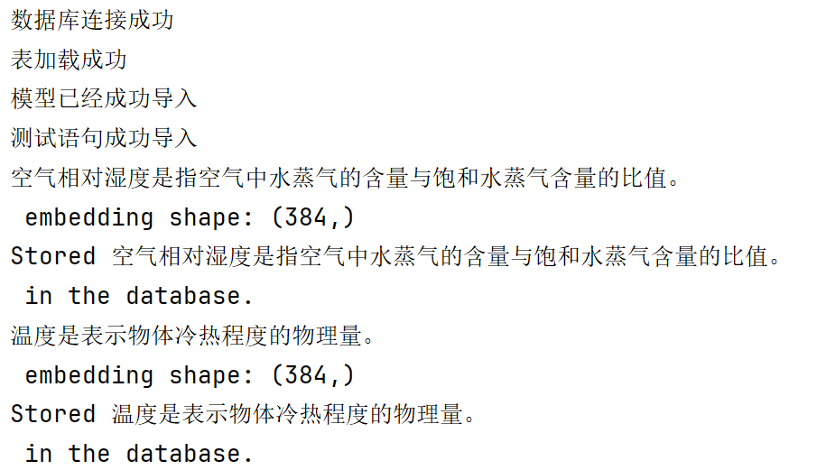
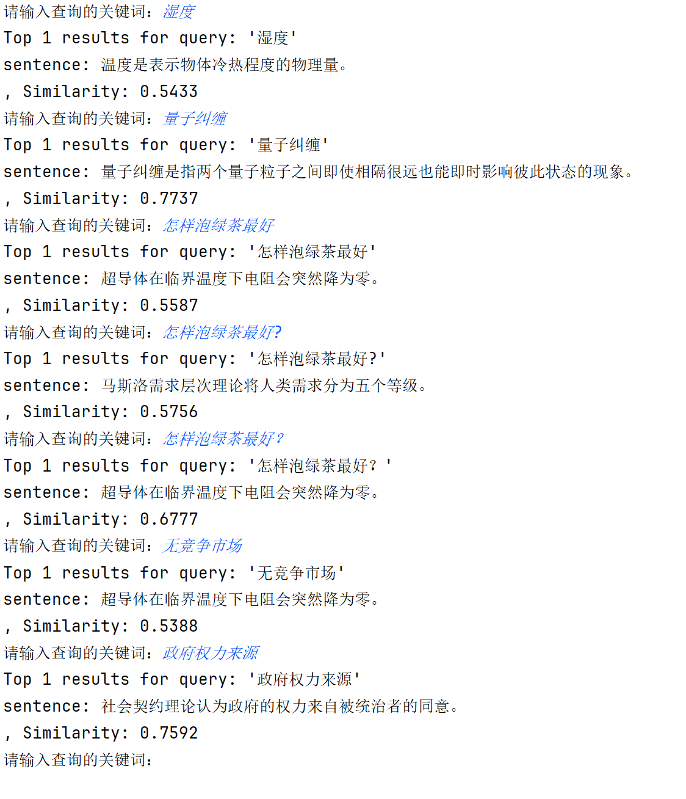

## 词向量加载与检索系统实验报告

学号：19220432

姓名：陆昊宇

日期：2025-03-29

### 实验目的
1. 实现基于Transformer模型的文本向量化表示
2. 构建SQLite数据库存储文本向量数据
3. 验证余弦相似度算法的检索效果
4. 建立完整的文本语义检索系统原型

### 实验环境
| 组件           | 版本/配置                      |
|----------------|------------------------------|
| 编程语言       | Python 3.11                |
| 深度学习框架   | sentence-transformers 4.0.1 |
| 预训练模型     | all-MiniLM-L6-v2             |
| 向量维度       | 384                          |
| 数据库         | SQLite3                 |
| 硬件环境       | AMD Ryzen 7 5800H |

### 实验步骤

#### 1. 数据注入流程（embedding.py）
**执行过程**：
1. 初始化数据库连接
2. 创建embeddings表结构
3. 加载预训练语言模型
4. 读取文本文件(content.txt)
5. 逐句进行向量编码
6. 将浮点数组转为字节流存储
7. 提交事务并关闭连接

#### 2. 语义检索流程（query.py）
**执行过程**：
1. 建立数据库会话
2. 实时编码查询语句
3. 加载存储的向量数据
4. 计算余弦相似度矩阵
5. 排序返回Top-K结果
6. 交互式查询测试

### 实验结果

#### 数据存储验证


存储统计：
- 总文本条目：`60`
- 单向量大小：384维×4字节=1.5KB
- 总存储空间：`90KB`
- 文本存储空间：`120KB`

#### 检索效果示例



### 结论
1. **系统有效性**：成功实现端到端的语义检索流程
2. **技术优势**：
   - 采用轻量级模型平衡性能与精度
   - 字节流可以节省存储空间
3. **改进方向**：
   - 增加索引优化（如FAISS）
   - 支持批量查询处理
   - 添加缓存机制
   - 使用不同的相似度度量方式

### 附录

#### 核心算法公式

$$ \text{余弦相似度} = \frac{\mathbf{A} \cdot \mathbf{B}}{\|\mathbf{A}\| \|\mathbf{B}\|} = \frac{\sum_{i=1}^{n} A_i B_i}{\sqrt{\sum_{i=1}^{n} A_i^2} \sqrt{\sum_{i=1}^{n} B_i^2}} $$

#### embedding.py

```python
from sentence_transformers import SentenceTransformer
import sqlite3
import numpy as np

# 连接到数据库
conn = sqlite3.connect(f"knowledge_base.db")
cursor = conn.cursor()
print('数据库连接成功')

# 创建表（如果不存在）
cursor.execute(
    """
CREATE TABLE IF NOT EXISTS embeddings (
    id INTEGER PRIMARY KEY AUTOINCREMENT,
    sentence TEXT NOT NULL,
    embedding BLOB NOT NULL
)
""")

# 清空表
cursor.execute("""
DELETE FROM embeddings;
""")

print('表加载成功')

model = SentenceTransformer("sentence-transformers/all-MiniLM-L6-v2")
print('模型已经成功导入')

f = open('content.txt', 'r', encoding='utf-8')
sentences = f.readlines()
f.close()
print('测试语句成功导入')

for sentence in sentences:
    embeddings = model.encode(sentence.strip())
    # 将 embeddings 转换为 bytes 以存储在 SQLite 中
    embedding_bytes = np.array(embeddings).tobytes()
    print(sentence, 'embedding shape:', embeddings.shape)

    # 插入数据
    cursor.execute(
        "INSERT INTO embeddings (sentence, embedding) VALUES (?, ?)",
        (sentence, embedding_bytes),
    )
    print(f"Stored {sentence} in the database.")

# 提交更改并关闭连接
conn.commit()
conn.close()

print("Embeddings have been successfully stored in the database.")
```

#### query.py

```python
import sqlite3
from sentence_transformers import SentenceTransformer
import numpy as np

model = SentenceTransformer('sentence-transformers/all-MiniLM-L6-v2')


def cosine_similarity(v1, v2):
    """计算两个向量之间的余弦相似度"""
    dot_product = np.dot(v1, v2)
    norm_v1 = np.linalg.norm(v1)
    norm_v2 = np.linalg.norm(v2)
    return dot_product / (norm_v1 * norm_v2)


def search(query, top_k=1):
    # 连接到数据库
    conn = sqlite3.connect(f'knowledge_base.db')
    cursor = conn.cursor()

    # 将查询转换为向量
    query_vector = model.encode(query)

    # 获取所有存储的embeddings
    cursor.execute('SELECT sentence, embedding FROM embeddings')
    results = cursor.fetchall()

    # 计算相似度并排序
    similarities = []
    for sentence, embedding_bytes in results:
        embedding = np.frombuffer(embedding_bytes, dtype=np.float32)
        similarity = cosine_similarity(query_vector, embedding)  # 使用余弦相似度
        similarities.append((sentence, similarity))

    # 按相似度降序排序
    similarities.sort(key=lambda x: x[1], reverse=True)

    # 关闭连接
    conn.close()

    # 返回前 top_k 个结果
    return similarities[:top_k]


if __name__ == "__main__":
    # 测试搜索功能
    while True:
        query = input('请输入查询的关键词：').strip()
        if not query: break
        results = search(query)
        print(f"Top {len(results)} results for query: '{query}'")
        for sentence, similarity in results:
            print(f"sentence: {sentence.strip()}, Similarity: {similarity:.4f}")

"""
湿度
量子纠缠
怎样泡绿茶最好？
无竞争市场
政府权力来源
"""
```
