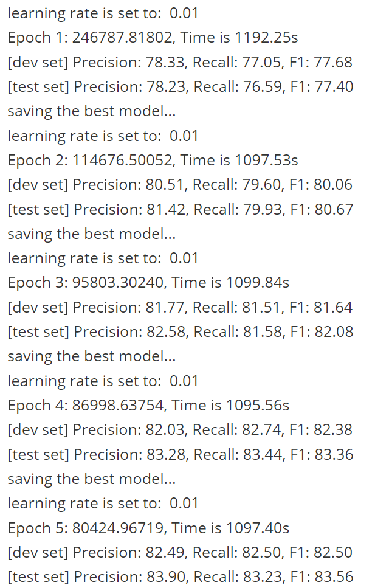
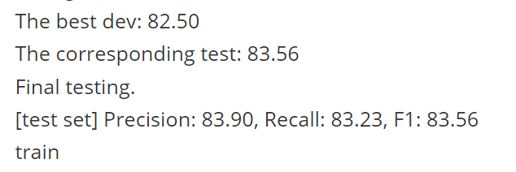

# 论文复现

## 关于论文

论文链接：[Dependency-Guided LSTM-CRF for Named Entity Recognition](https://www.aclweb.org/anthology/D19-1399.pdf)

### 主要内容

#### 背景：BiLSTM-CRF
传统的命名实体识别（NER）任务通常采用双向长短期记忆网络（BiLSTM）结合条件随机场（CRF）的架构。具体流程如下：
- **输入表示**：每个词的表示由词嵌入和字符级表示拼接而成。
- **BiLSTM层**：捕获上下文信息，生成每个词的上下文表示。
- **CRF层**：建模标签之间的转移关系，输出最优标签序列。

#### 依赖引导的LSTM-CRF（DGLSTM-CRF）
为了利用句法依赖树中的长距离依赖和语义关系，作者提出了依赖引导的LSTM-CRF模型。其核心思想是通过依赖树的结构信息增强词表示，并建模词与其依赖父节点之间的交互。

##### 输入表示增强
- **依赖信息编码**：对于依赖树中的每条边（父节点、子节点、依赖关系），将子节点的词表示、父节点的词表示以及依赖关系嵌入拼接，形成增强的输入表示：
  $$
  \mathbf{u}_i = \left[\mathbf{w}_i; \mathbf{w}_h; \mathbf{v}_r\right]
  $$
  其中，$\mathbf{w}_i$和$\mathbf{w}_h$分别是子节点和父节点的词表示，$\mathbf{v}_r$是依赖关系的嵌入。

##### 神经网络架构
- **多层BiLSTM与依赖交互**：
  - 第一层BiLSTM生成初始隐藏状态。
  - 通过交互函数$g(\mathbf{h}_i, \mathbf{h}_{p_i})$建模子节点与父节点隐藏状态之间的关系。交互函数可以是拼接、加法或多层感知机（MLP）。
  - 第二层BiLSTM进一步捕获依赖树中的高阶交互（如祖孙依赖）。
  - 最终通过CRF层预测标签序列。

- **交互函数**：
  - **自连接**：直接使用子节点的隐藏状态。
  - **拼接**：将子节点和父节点的隐藏状态拼接。
  - **加法**：将子节点和父节点的隐藏状态相加。
  - **MLP**：通过非线性变换建模复杂交互，类似于图卷积网络（GCN）的形式。

##### 数学形式
第$l+1$层的隐藏状态计算如下：
$$
\mathbf{H}^{(l+1)} = \text{BiLSTM}\left(f\left(\mathbf{H}^{(l)}\right)\right)
$$
$$
f\left(\mathbf{H}^{(l)}\right) = \left[g(\mathbf{h}_1^{(l)}, \mathbf{h}_{p_1}^{(l)}), \cdots, g(\mathbf{h}_n^{(l)}, \mathbf{h}_{p_n}^{(l)})\right]
$$
其中，$p_i$是词$x_i$的父节点索引。

#### 实验与效果
- **数据集**：在OntoNotes 5.0（英语和中文）、SemEval-2010（加泰罗尼亚语和西班牙语）等数据集上验证模型。
- **实验结果**：
  - DGLSTM-CRF显著优于传统BiLSTM-CRF，尤其在长实体识别上表现突出。
  - 依赖关系（如`pobj`、`nn`）与实体类型（如LOC、GPE）具有强相关性，模型通过依赖信息提升了召回率。
  - 在低资源场景下，依赖信息的引入显著提升了性能。

#### 关键创新
- **依赖树编码**：首次完整利用依赖树结构，建模长距离依赖和语义关系。
- **交互函数**：通过多种交互函数灵活捕捉父子节点间的语义关联。
- **多语言适用性**：在多种语言上验证了模型的有效性。

#### 未来方向
- 联合建模NER和依赖解析，将实体作为依赖树中的单一单元。
- 探索更高阶的依赖关系（如兄弟节点）对NER任务的影响。

## 关于代码

作者提供了代码仓库：[ner_with_dependency](https://github.com/allanj/ner_with_dependency)

通过以下命令即可获取代码：

```bash
git clone https://github.com/allanj/ner_with_dependency.git
```

## 关于数据集

本实验使用OntoNotes数据集，该数据集需要经过处理后才能使用。

作者提供了两种方案：

1. 按照 [pytorch_neural_crf](https://github.com/allanj/pytorch_neural_crf/blob/master/docs/benchmark.md) 的方法进行处理
2. 通过 [OntoNotes](https://drive.google.com/file/d/10t3XpZzsD67ji0a7sw9nHM7I5UhrJcdf/view) 链接直接下载

本实验选用后者。

## 实验过程

将 `train.sd.conllx`, `dev.sd.conllx`, `test.sd.conllx` 放在 data/ontonotes 目录下。

将 `glove.6B.100d.txt` 预训练词向量放在 data 目录下。

在 terminal 中执行以下命令运行代码：

```bash
python main.py --num_epochs 5 > result.txt
```

由于设备资源限制，本实验仅进行 5 个 epoch.

## 实验结果

### 训练过程



### 验证与测试



## 实验收获

通过复现论文中的DGLSTM-CRF模型，成功验证了依赖树结构对NER任务的有效性。实验结果表明，在OntoNotes数据集上，模型能够利用依赖关系（如`pobj`、`nn`）提升实体识别的性能，尤其是在长实体的识别上表现更好。
