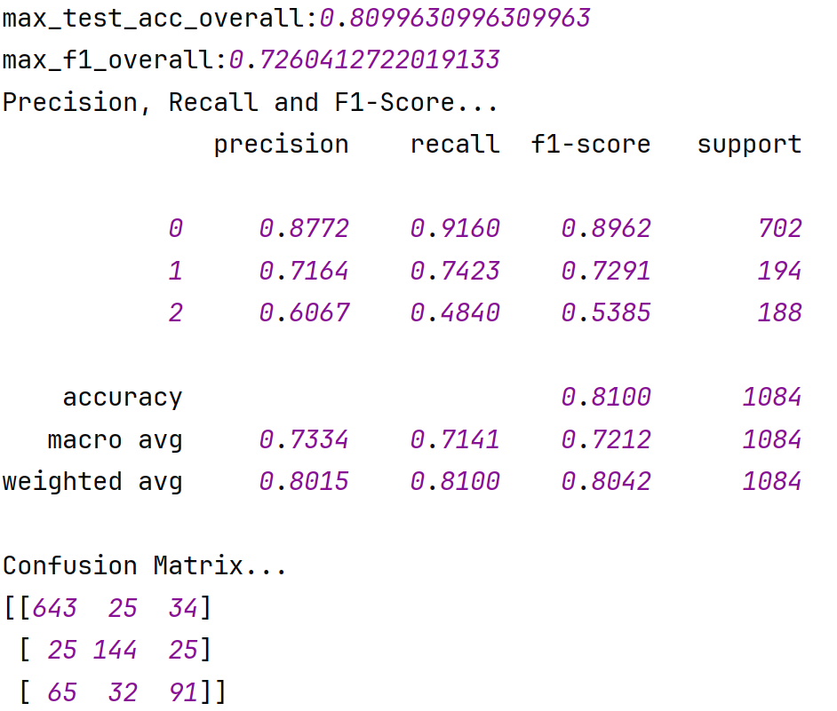
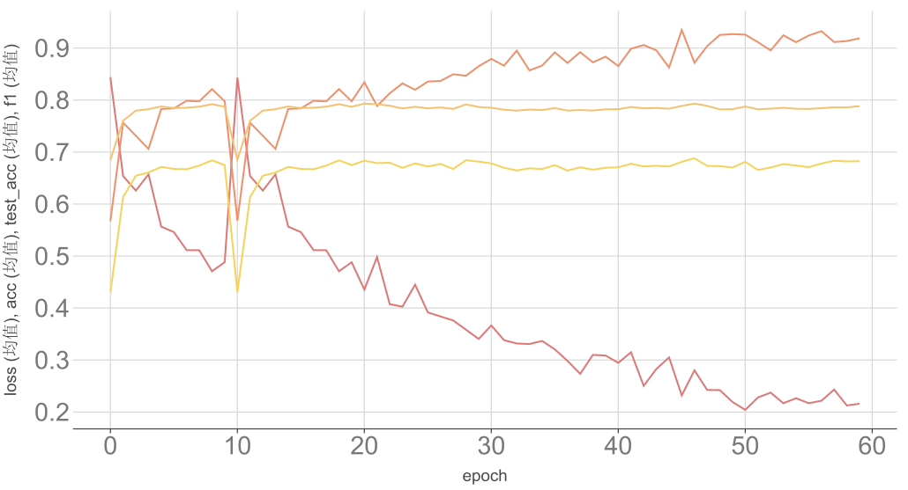

# 论文复现

## 关于论文

论文链接：[Dual Graph Convolutional Networks for Aspect-based Sentiment Analysis](https://aclanthology.org/2021.acl-long.494.pdf)

### 主要内容

该论文提出了一种名为DualGCN（双图卷积网络）的新模型，用于解决基于方面的情感分析（ABSA）任务中的两个主要挑战：依赖解析结果的不准确性以及在线评论中非正式表达和复杂性带来的问题。

DualGCN通过结合语法结构和语义相关性，设计了两个模块：SynGCN（基于语法的图卷积网络）和SemGCN（基于语义的图卷积网络）。SynGCN利用依赖解析器生成的概率矩阵来丰富语法知识，而SemGCN通过自注意力机制捕捉语义相关性。

此外，论文还提出了正交和差分正则器，分别用于减少语义注意力矩阵的重叠和确保语义特征与语法特征的差异性。

实验在三个公开数据集上进行，结果表明DualGCN在性能上优于现有方法，验证了其有效性。论文还提供了详细的消融研究和案例分析，进一步展示了各模块的作用和正则器的贡献。

## 模块设计

代码仓库：[github](https://github.com/Mr-LUHAOYU/NLP/tree/main/%E7%AC%AC%E4%BA%94%E7%AB%A0/SynGCN)

### 数据处理

将 XML 格式的餐厅评论数据集转换为 JSON 格式。

对文本数据进行预处理（包括分词、词性标注、依存句法分析等）。

### SynGCN模型架构

1. **输入处理流程**：

   - 输入：词序列 + 依存树结构(head/deprel) + 位置信息
   - 通过`inputs_to_tree_reps`将依存树转换为邻接矩阵

2. **核心组件**：

   - **BiLSTM编码器**：先对文本序列进行双向编码

   - **多层GCN**：在依存树结构上进行信息传播
  - 每层计算：$H^{(l+1)} = ReLU(AH^{(l)}W^{(l)})$
     - $A$为归一化的依存树邻接矩阵

3. **特征聚合**：

   - 对aspect词对应的节点特征进行平均池化
   - 最终通过线性层分类

4. **关键创新**：

   - 利用依存句法树作为图结构
   - 结合序列(BiLSTM)和图(GCN)的双重编码

5. **超参数**：

   - `hidden_dim`：GCN隐藏层维度
   - `num_layers`：GCN层数
   - `direct/loop`：控制是否使用有向图和自环

## 实验过程

1. **数据集构建**：

   - 在SynGCN目录下新建dataset目录
   - 放入数据集dataset/Restaurants_Train.xml, dataset/Restaurants_Test_Gold.xml
   - 运行xml2json.py
   - 运行prepare_vocab.py
2. **模型训练与评估**：
   - 运行train.py, 训练模型
   - 运行extract_result.py, 抓取模型训练日志

## 实验结果

### 最佳性能与指标

### 训练过程

