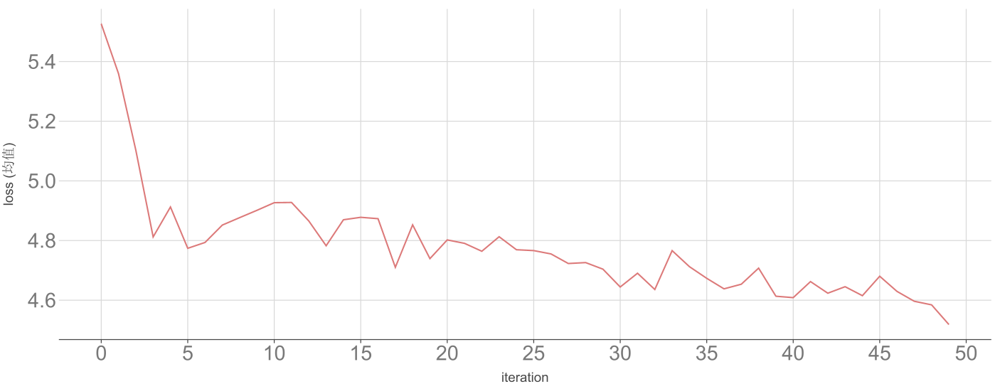

# Seq2Seq Model

19220432 陆昊宇

[TOC]

## Task One

**开放世界游戏角色自动对话生成**
在开放世界游戏（如《赛博朋克2077》《原神》）中，为NPC生成符合角色设定、剧情背景且动态响应用户交互的对话，要求兼具沉浸感、多样性和逻辑一致性。

### 通用生成指标（基础评估） 
   - **BLEU / ROUGE**：对比生成对话与人类撰写对话的n-gram重叠度，但游戏对话强调创意，低分未必代表质量差。 
   - **Perplexity**：衡量语言模型困惑度，确保语句流畅，但无法评估角色一致性。 
   - **多样性（Distinct-n）**：计算生成对话的词汇/句式多样性，避免重复模板回复。 

### 任务特定指标（核心评估） 
#### 角色一致性（Character Consistency） 
   - **性格匹配度**： 
     - 基于角色设定（如“暴躁兽人”“优雅精灵”），用风格分类模型（如BERT）判断生成对话是否符合预设性格（如粗鲁/礼貌词汇比例）。 
     - 示例：生成“兽人”对话应包含更多威胁性词汇（如“碾碎你！”），而非“愿您平安”。 
   - **背景知识对齐**：
     - 检查生成内容是否违反角色背景（如“农民NPC谈论量子物理”）。 
     - 方法：构建角色知识图谱，用关系抽取模型（如REBEL）验证对话实体是否合理。 

#### 动态交互性（Dynamic Responsiveness） 
   - **上下文相关度**： 
     - 评估对话是否延续玩家上一句的语义（如玩家问“去哪找宝藏？”，NPC应提供线索而非切换话题）。 
     - 量化方法：计算玩家输入与NPC回复的语义相似度（Sentence-BERT）。 
   - **多轮对话连贯性**： 
     - 模拟10轮对话，统计话题跳转次数和逻辑断裂点（如突然从“战争”转到“烹饪”）。 

#### 叙事融合度（Narrative Integration） 
   - 任务/剧情关联性： 
     - 若玩家正在执行“盗贼公会任务”，NPC对话应提及相关关键词（如“阴影”“贿赂”）。 
     - 检测工具：关键词提取 + 剧情状态匹配（如游戏引擎标记当前任务ID）。 
   - 分支选项合理性： 
     - 生成对话应提供可选的互动分支（如“接受任务”“拒绝并威胁”），且每条分支逻辑自洽。 
     - 评估：人工检查选项是否影响后续剧情（如拒绝任务后NPC态度恶化）。 

#### 玩家体验（Player-Centric Metrics） 
   - 沉浸感评分： 
     - 玩家调查问卷（1-5分）评估“是否感觉NPC是真实存在的？”。 
   - 挫败感检测： 
     - 监控玩家在与NPC对话后的行为（如频繁跳过对话或攻击NPC），间接反映生成质量。 

### 对抗性测试（Robustness Checks） 
   - 胡言乱语输入：玩家输入无关内容（如“asdfg”），检测NPC是否优雅处理（如“我听不懂，但也许酒馆老板知道”）。 
   - 伦理安全性： 
     - 过滤生成内容中的暴力/歧视言论（如基于词表或 moderation API）。 
     - 避免NPC泄露游戏未公开信息（如剧透终极Boss身份）。 

## Task Two

### 数据处理

读取`.parquet`文件中的数据，构建词汇表和句子对，输出为`.lang`文件和`pairs`文件。

### 模型结构

模型分为 **编码器** 和 **解码器** 两个部分。

#### 编码器

| 组件               | 功能说明                               |
| ------------------ | ------------------------------------------ |
| `nn.Embedding` | 将输入的单词索引（整数）转换为稠密词向量。 |
| `nn.GRU`       | 对词向量序列进行编码，输出隐藏状态。       |

#### 解码器

| 组件     | 功能说明      |
| :----------------------- | :----------------------------------- |
| `nn.Embedding` | 将离散单词ID转换为连续向量。         |
| `nn.Dropout`  | 随机置零部分神经元，防止过拟合。     |
| 缩放点积注意力       | 动态计算编码器输出的加权上下文向量。 |
| `nn.GRU`        | 更新隐藏状态，捕捉序列依赖关系。     |
| Beam Search | 扩展多路径搜索，提升生成质量。       |

**Beam Search 流程**

1. 初始化 Beam  	 从 `<SOS>` 开始，初始隐藏状态为编码器最终状态 
2. 序列扩展                   对每个候选序列生成 `beam_width` 个候选词
3. 路径评分                   累计对数概率：`new_score = score + log_prob` 
4. 筛选 Top-k               保留全局概率最高的 `beam_width` 个序列 
5. 终止条件                   所有序列生成 `<EOS>` 或达到最大长度
6. 返回结果                   选择分数最高的序列（可选长度归一化）

### 模型训练

### 模型测试

| BLEU | Latency (per sentence) | Latency (per word) |
| :--: | :--------------------: | :----------------: |
| 0.06 |         780 ms         |       74 ms        |

